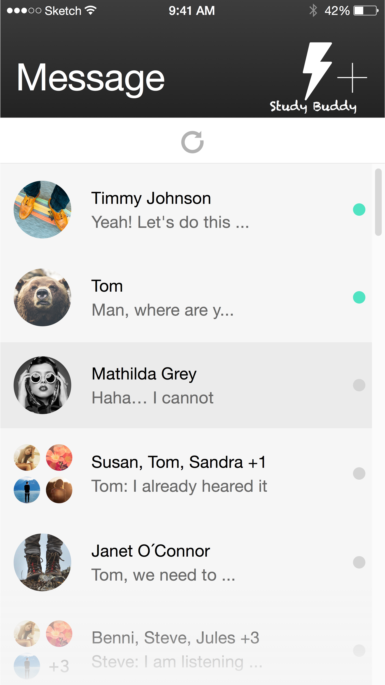
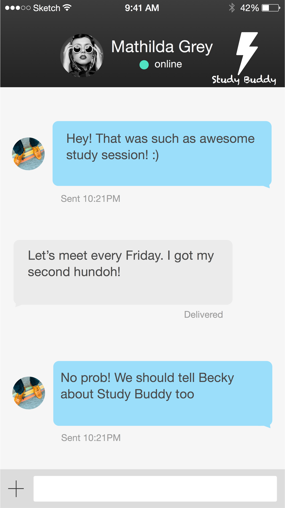

#Heart of Gold

##<i>"StudyBuddy"</i>

##Team

###**Brenton Chasse**   - Backend/Databases - Dojo Sempai

<b>Bio:</b>  Brenton is a Senior Computer Systems Engineering student pursuing a minor in Computer Science. This developer is familiar with using the Dojo Javascript toolkit for front end web application development. He looks forward to furthering his knowledge of the Dojo toolkit by using it on top of node.js on the back end.

###**Grayson Kempster** - Backend/Databases

<b>Bio:</b> Grayson is a Junior Computer Science major with a focus on physics. He work as an RA in the Washington Tower of the SouthWest residence area. This developer was raised in a small town called Hopedale in MA where I earned the rank of Eagle Scout in the local Boy Scout troop. I am good at creative problem solving, and have experience with Java, HTML, C, and UNIX. In terms of this project I am interested in database management, graphic design, and function design.

###**Gary White**       - Frontend/UI

<b>Bio:</b> Gary has experience working on large-scale projects, including their documentation, from cs320. This developer has a fair amount of Web Development experience using the following languages and protocols: JavaScript, HTML, CSS, XAML, XML, PHP, and SQL. Gary is most interested in UI design for this project.

###**Philron Hozier**   - Frontend/UI

<b>Bio:</b> Philron is currently a Junior at UMass Amherst pursuing a BS Computer Science degree. My attraction to design is what drives my interests in user interface, software development and the user's experience.   This developer has past experience developing two, rather small, mobile applications in Objective-C for iOS (teacher absentee app, music lyric app).

###**Main Khan**        - Networking/Data Parsing

<b>Bio:</b> Main is currently a Sophomore seeking a double major in Computer Science and Computational Mathematics. He is interested in working on front end for this project.

###**Tyler Caldwell**   - Networking/Data Parsing

<b>Bio:</b> Tyler is a Junior comp sci/econ dual-degree student at UMass. He is interested in software engineering and computational social science.

*Brenton Chasse, 3/13/15*

##Project Idea Summary
<!---
Just a basic run-through
-->
<b>"StudyBuddy"</b> aims to ease unnecessary stress associated with higher learning. Educational growth is usually accompanied by various sources of stress, such as worrying about grades or finding people to study with. Processes which we aim to simplify and streamline to make life easier for those who have enough to worry about.

When a new user visits our site, they will be greeted with an intuitive and simple interface that will guide them through the creation of their profile. Here our users will enter basic information, such as their name, age, and major, followed by more personal information such as a short bio, currently enrolled courses, and preferred study habits (music, location, willing travel distance, learning type).

Once a user has created their profile, we will begin creating matches and suggesting study partners for them. Using our algorithms, we will rank the user's matches on a scale of more to less "study compatible." This line-up of matches is then presented to the user through their mobile/full browser. From this point, our users have the final decision as to whether or not they want to connect with a suggested match, or to pass on the matched study partner. Users will only be notified of another user's choice if they both say yes; thus making them "study buddies." Only then will they be able to contact each other to organize a meeting.

*Grayson Kempster, 03/13/15*

##Disclaimer
<!--
Status of the functional specification, what it does and does not discuss
-->
By no means does this functional specification outline how our site will behave and appear to the user in our final application. Implemented features may be adapted, modified, expanded, added, and removed as we develop our web application and further our understand the needs in the niche that our application seeks to fulfill. In our development, we strive to provide a simple, intuitive, and visually pleasing user interface which provides high quality and robust user interactions. As we develop, we will update this document so that the specifications listed will be accurate to our final application.

*Brenton Chasse, 03/12/15*

##Revision History
<!--
To be updated throughout the semester
-->
##Use Cases
1. Javaris Jamar Javarison-Lamar is freshmen student at UMass and is overwhelmed by the difficulty of his college courses. He is looking for some people to study with in several of his classes; however, nobody in his dorm shares any of his classes making it difficult to meet up with people in person to complete homework. Luckily for Javaris, he can use StudyBuddy to ease his problems. He simply creates an account and completes his profile and is now ready to meet with people and get studying.
2. D’Squarious Green Jr. is a physics student who decided to drop his linear algebra class within the add/drop period. Unfortunately for X-Wing @Alliciousness, D’Squarious’s "StudyBuddy" for that class, he will no longer have someone to do his homework with. He goes on to his StudyBuddy profile and removes linear algebra from his currently enrolled classes. X-Wing gets a notification from StudyBuddy telling him that D’Squarious is no longer his "StudyBuddy".
3. Tyroil Smoochie-Wallace and L’Carpetron Dookmarriot have moved off campus for the semester making it difficult for them to work with their study group from last semester. In order for them to find new a new study group they want to use StudyBuddy and get together with some other off-campus students. To do so, they simply go onto their StudyBuddy profile and edit their campus location and how far they are willing to travel (luckily, Tyroil owns his own car making travel not much of an issue).
4. Fudge has returned to college after a successful summer interning for Squeeps Inc. He would like to update his bio to reflect his new found experience in biochemical engineering. Fudge signs in to StudyBuddy and adds a paragraph about his new professional experience to his bio, and is immediately 10x more popular on StudyBuddy.
5. J’dinkalage Morgoone and Torque Lewith are looking to meet new people. They are both in a large Bosnian Film Theory lecture, and are struggling with the subtleties of some of the assignments. None of their friends are taking the class with them, and they would like to find some classmates to work with. They sign on to StudyBuddy and create a new study group that is open to new members, and find Nyquillus Dillwad, a Bosnian film genius who is looking to share his wisdom with his less cultured classmates.
6. Davoin Shower-Handel has entered all of his currently enrolled classes and study habits into his StudyBuddy profile. He has completed his bio, and is ready to put himself out there and make some "StudyBuddies". As he looks through the buddies that StudyBuddy believes will be compatible with him, Davoin discovers Hingle McCringleberry. Hingle is everything Davoin has ever searched for in a "StudyBuddy" -- he likes to work in a quiet environment, he is a visual learner, and he can meet at all of the same times as Davoin. Davoin elects to match with Hingle, and hopes Hingle will do the same.
7. Jackmerius Tacktheritrix and Leoz Maxwell Jilliumz have mutually chosen to become "StudyBuddies", after StudyBuddy’s algorithms suggested that they might be compatible. StudyBuddy has connected them by sharing the contact information they provided for sharing with their matches. Jackmerius anxiously sends Leoz a hopeful email asking to arrange a study meeting.
8. D’marcus Williams, Ibrahim Moizoos, and Quatro Quatro have all decided to form a study group. They need to study for their Thursday afternoon final in sports management and, because they are playing in the looming East-West bowl, they are all on tight schedules. Luckily, they were able to find people with compatible study habits through StudyBuddy and can now contact one-another to set up a time, date, and meeting place that works for them. Using the contact information they shared on StudyBuddy, they decide to meet on Wednesday night at the library and have an all-night study session.

*Tyler Caldwell and Main Khan, 03/11/15*

##Non-Goals
* We are not planning on implementing GPS location services, although that could be a feature in future implementations. We plan on keeping the location aspect limited to inputs for University of enrollment, and distance willing to travel.
* Distance willing to travel will be based on a local/regional/state basis, not on physical location. Harvesting relative location data for all possible universities is overkill since it would simply emulate gps location services.
* We are not currently planning on adding features for managing existing study groups. StudyBuddy is meant to be a study-match-making application rather than a team management application (of which there are already many).

*Tyler Caldwell, Main Khan and Brenton Chasse, 03/12/15*

##Open Issues
<!--
A list
-->
* Do we want to support older browser versions?
* How will we ensure that two people see the same real time message stream while messaging?
* implementation of a messaging module? or sharing of contact info?
* Is there demand for matching "StudyBuddies" of different Universities? (i.e.: UMass student matching with a Smith College student)
* Matching between sessions of the same class?
* Separate "grade calculator" element included?
* dropdown to match existing classes that students entered before you?

*Brenton Chasse and Grayson Kempster, 03/13/15*

##Known Database Requirements
<!--
A list of things we know we want the database to be able to do 
-->
Bold/bulleted lines indicate that the bullet's nested contents should be wrapped with an object.
* Client side queries should be observable and should have events when the query changes on the server side
* <b>Buddy object contains</b>:
	* Display Name - uuid [could be real name (facebook integration -> anti-trolling)]
	* <b>Contact Information</b>:
		* Real Name
		* Preferred method of contact (what contact info to share once matched)
		* Cell Phone Number
		* School email
		* Personal email (email address used for username recovery/backup password recovery)
	* <b>University</b>:
		* Name
		* State
		* Graduation Year
		* Major
	* Courses:
		* <b>Course</b>:
			* Goal grade
			* Level of current comprehension
	* <b>Preferences</b>:
		* <b>Study method preferences</b>:
			* user preference here
			* user preference here
		* <b>Study location preferences</b>:
			* user preference here
			* user preference here

*Brenton Chasse and Grayson Kempster, 03/13/15*

##User-Perspective Flowchart
<!--
-->
The Flowchart is outlined in the slideshow included with this specification.

*Gary White 3/13/2015*

##Wireframes

 1. Login - The user is first greeted by a minimal login interface. The interface is concise and allows the user to choose between 'Sign Up' or 'Login.'  
*Technical note: We may or may not use OAuth standards for application login.*
   2. User Profile - The user is able to create custom views of thier "StudyBuddy" profile. More importantly, the user is able to list classes currently being taken, thier major and their extracurricular interests.  These specifications are included to meet the user's needs.   

 
3. Messenger Overview - The user is able to communicate with other students in mutual course "hubs." The shared interest spaces helps users to find others who are interested in forming study sessions quickly. 
4. Messenger - The user is able to message indivdual "buddies" to discuss upcoming events, chart out new study groups and more! An application holds true to its orginal intent. It provides space for students who are looking for fellow students to study with a connection to open communication. 

*Philron Hozier, 03/13/15*

<!--
At least 5, with explanation as to how it meets user needs, and a list of
open issues for aspects of the application that will be answered as development
proceeds
-->

<!-- Each section must be annotated with the author and date of that section -->
<!-- We have to relate the project idea to our general education courses -->
<!-- We also have to update the README.md in the root with a section about
     the functional specification, and describing which files we created for
     this assignment that we want reviewed by the grader -->
<!-- We have to make weekly team meeting notes for each week since the second
     assignment was released in the docs/Notes directory -->
<!-- Include any prototype code or research we've done up to this point -->
<!-- Describe log-in and authentication functionality too -->
